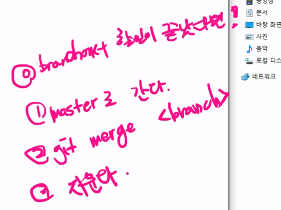

# 프로젝트1

## 개요

## 오늘 배운 내용

`git branch <name>`

개발용 가지 만들기

`git switch  <name>`

개발용 가지로 변경

`git merge <name>`

개발 이후 합치기

`git branch -d <name>`

합친 이후 가지치기

### Remote

Local => Remote

1. 리모트 생성 
2. 경로지정 (구분을 위해서 이름을 지정해야한다. )
   1. `git remote add <name> address`
   2. `git remote add origin https://github.com/ujaei21/first_remote_repo.git`
3. 업로드
   1.  `git push origin master` 오리진의 마스터를 올리세요! 라는 의미
